# Plan

1. Cognitive maps

    1. Cognitive maps

    2. Allocentric vs. egocentric navigation

    3. Goal-directed learning vs habitual behavior

2. Successor representations

    1. Model-free vs. Model-based

    2. Successor representations

    3. Successor features

3. Neurobiological support for the SR hypothesis

    1. Stachenfeld et al. (2017). The hippocampus as a predictive map.

    2. Momennejad et al. (2017). The successor representation in human reinforcement learning.

    3. Geerts et al. (2020). A general model of hippocampal and dorsal striatal learning and decision making.

# 1 - Cognitive maps

# Cognitive maps in the hippocampus

[leftcol]

* Cognitive maps (Tolman, 1948) denote the ability to extract **relational knowledge** about objects or places and use it to flexibly adapt behavior. 

* This relational knowledge can even be learned in the absence of rewards (implicit or **latent learning**).

* Cognitive maps have been linked to the hippocampus in spatial navigation tasks (**place cells**), but also in non-spatial cognitive tasks.

    * transitive inference (A > B and B > C $\rightarrow$ A > C)
    * temporal order, causality
    * social hierarchies
    * generalization

* Abstract concepts can be represented in 1D or 2D maps, and neural firing in the hippocampal-entorhinal formation can be decoded accordingly. 

[rightcol]

{width=80%}

[endcol]

[citation Tolman, EC. Cognitive maps in rats and men. American Psychological Association; 1948.]

[citation O'Keefe, J, Nadel, L. The hippocampus as a cognitive map. Oxford: Clarendon Press; 1978.]

# Hippocampal zoo

{width=70%}

[citation Behrens, T. E. J., Muller, T. H., Whittington, J. C. R., Mark, S., Baram, A. B., Stachenfeld, K. L., et al. (2018). What Is a Cognitive Map? Organizing Knowledge for Flexible Behavior. Neuron 100, 490–509. doi:10.1016/j.neuron.2018.10.002.]

# Reinforcement learning in the basal ganglia

[leftcol 60]

* **Reward-guided learning**, reinforcement learning (RL) or operant conditioning rely mostly on the basal ganglia (BG), which learns to associate actions to expected rewards.

* Dopamine (DA) released by VTA and SNC represents **reward prediction error** that drives learning in the BG:

    * Surprisingly good actions are reinforced, surprisingly bad ones are avoided.

* The BG is structured in three main parallel (but communicating) loops with the cortex:

    * The **limbic loop** through the ventral striatum is involved in learning the motivational value of outcomes and their predictors.

    * The **associative loop** through the DMS learns to select plans towards an outcome and maintain the relevant information into the WM.

    * The **sensorimotor loop** through the DLS learns to select actions that lead to a particular outcome.

[rightcol 40]

[endcol]

[citation Source: <https://www.researchgate.net/figure/Neurobiological-correlates-of-model-free-and-model-based-reinforcement-learning-The-key_fig1_291372033>]

# Allocentric vs. egocentric navigation

[leftcol]

* Two strategies are observed in navigational tasks, depending on familiarity:

    * Place strategy (allocentric) relies on a spatial cognitive map (place cells).

    * Response strategy (egocentric) relies on S-R associations.

* The response strategy becomes dominant with overtraining, as it is computationally more efficient, but slower to build up.

* The place strategy is hippocampus-dependent, while the response strategy is BG-dependent.

[rightcol]

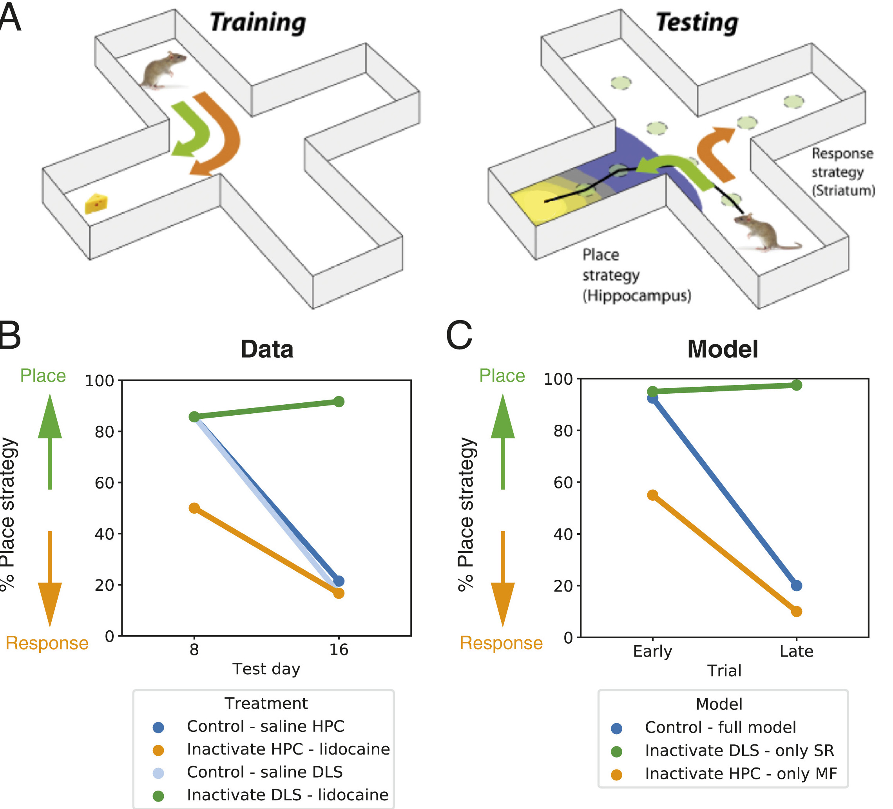

[endcol]

[citation Geerts, J. P., Chersi, F., Stachenfeld, K. L., and Burgess, N. (2020). A general model of hippocampal and dorsal striatal learning and decision making. PNAS 117, 31427–31437. doi:10.1073/pnas.2007981117.]

# Goal-directed learning vs. habitual behavior

* **Goal-directed** behavior learns R $\rightarrow$ O associations.

    * "What should I do in order to obtain this outcome?"

    * Sensible to outcome revaluation.

* **Habits** are developed by overtraining  S $\rightarrow$ R associations. 

    * "I always do this in this situation."

    * Not sensible to outcome revaluation.

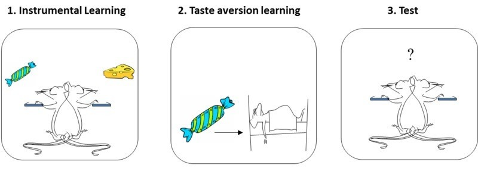{width=70%}

[citation Credits: Bernard W. Balleine]

# Two competing systems

* There seems to be two competing systems for action control:

    * One cognitive and flexible system, actively planning the future.

    * One habitual system abstracting and caching future outcomes.

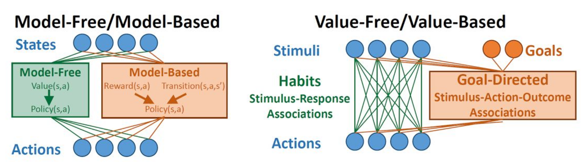

* The open question is the arbitration mechanism between these two segregated processes: who takes control when?

* Recent work suggests both systems are largely overlapping. See also Javier's model.

[citation Doll, B. B., Simon, D. A., and Daw, N. D. (2012). The ubiquity of model-based reinforcement learning. Current Opinion in Neurobiology 22, 1075–1081. doi:10.1016/j.conb.2012.08.003.]

[citation Miller, K., Ludvig, E. A., Pezzulo, G., and Shenhav, A. (2018). “Re-aligning models of habitual and goal-directed decision-making,” in Goal-Directed Decision Making : Computations and Neural Circuits, eds. A. Bornstein, R. W. Morris, and A. Shenhav (Academic Press)]

# 2 - Reinforcement learning

# Model-based vs. Model-free

* Model-free methods use the **reward prediction error** (RPE) to update values:

$$
    \delta_t = r_{t+1} + \gamma \, V^\pi(s_{t+1}) - V^\pi(s_t)
$$

$$
    \Delta V^\pi(s_t) = \alpha \, \delta_t
$$

* Encountered rewards propagate very slowly to all states and actions.

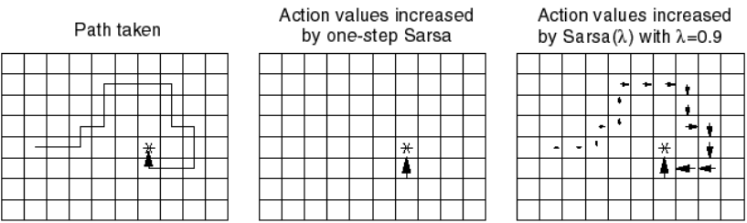{width=70%}

* If the environment changes (transition probabilities, rewards), they have to relearn everything.

* After training, selecting an action is very fast.

# Model-based vs. Model-free

* Model-based RL can learn very fast changes in the transition or reward distributions:

$$
    \Delta r(s_t, a_t, s_{t+1}) = \alpha \, (r_{t+1} - r(s_t, a_t, s_{t+1}))
$$

$$
    \Delta p(s' | s_t, a_t) = \alpha \, (\mathbb{I}(s_{t+1} = s') - p(s' | s_t, a_t))
$$

* But selecting an action requires planning in the tree of possibilities (slow).

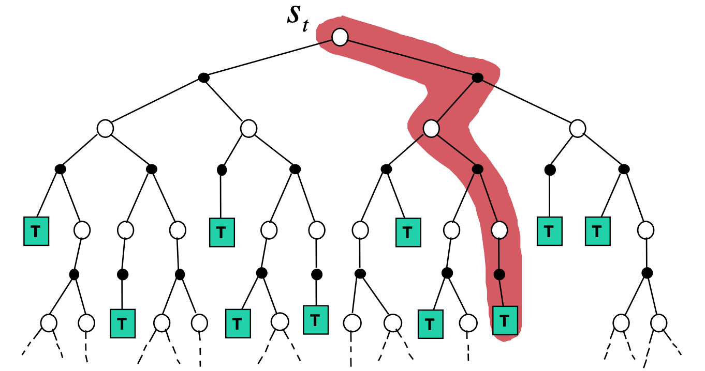{width=70%}

# Model-based vs. Model-free

* Relative advantages of MF and MB methods:

 

---------------------------------------------------------------------
              Inference  Sample          Optimality      Flexibility
              speed      complexity
------------- ---------- --------------- ------------    --------------
Model-free    fast       high            yes             no

Model-based   slow       low             as good as      yes
                                         the model
---------------------------------------------------------------------

 

* A trade-off would be nice... Most MB models in the deep RL literature are hybrid MB/MF models anyway.

# Successor Representations (SR)

* Successor representations (SR) have been introduced to combine MF and MB properties. Let's split the definition of the value of a state:

$$
\begin{align}
    V^\pi(s) &= \mathbb{E}_{\pi} [\sum_{k=0}^\infty \gamma^k \, r_{t+k+1} | s_t =s] \\
            &\\
               &= \mathbb{E}_{\pi} [\begin{bmatrix} 1 \\ \gamma \\ \gamma^2 \\ \ldots \\ \gamma^\infty \end{bmatrix} \times
                  \begin{bmatrix} \mathbb{I}(s_{t}) \\ \mathbb{I}(s_{t+1}) \\ \mathbb{I}(s_{t+2}) \\ \ldots \\ \mathbb{I}(s_{\infty}) \end{bmatrix}  \times
                  \begin{bmatrix} r_{t+1} \\ r_{t+2} \\ r_{t+3} \\ \ldots \\ r_{t+\infty} \end{bmatrix} 
                | s_t =s]\\
\end{align}
$$

where $\mathbb{I}(s_{t})$ is 1 when the agent is in $s_t$ at time $t$, 0 otherwise.

* The left part corresponds to the **transition dynamics**: which states will be visited by the policy, discounted by $\gamma$.

* The right part corresponds to the **immediate reward** in each visited state.

* Couldn't we learn the transition dynamics and the reward distribution separately in a model-free manner?

[citation Dayan, P. (1993). Improving Generalization for Temporal Difference Learning: The Successor Representation. Neural Computation 5, 613–624. doi:10.1162/neco.1993.5.4.613.]

# Successor Representations (SR)

* SR rewrites the value of a state into an **expected discounted future state occupancy** and an **expected immediate reward** by summing over all possible states $s'$ of the MDP:

$$
\begin{align}
    V^\pi(s) &= \mathbb{E}_{\pi} [\sum_{k=0}^\infty \gamma^k \, r_{t+k+1} | s_t =s] \\
               &= \sum_{s' \in \mathcal{S}} \mathbb{E}_{\pi} [\sum_{k=0}^\infty \gamma^k \, \mathbb{I}(s_{t+k+1}=s') \times r_{t+k+1}  | s_t =s]\\
               &\approx \sum_{s' \in \mathcal{S}} \mathbb{E}_{\pi} [\sum_{k=0}^\infty \gamma^k \, \mathbb{I}(s_{t+k+1}=s')  | s_t =s] \times \mathbb{E}_{\pi} [r_{t+k+1}  | s_{t+k+1}=s']\\
               &\approx \sum_{s' \in \mathcal{S}} M(s, s') \times r(s')\\
\end{align}
$$

* The underlying assumption is that the world dynamics are independent from the reward expectations.

    * Allows to re-use knowledge about world dynamics in other contexts (**latent learning**).

    * Not true, because the policy will visit more often the rewarding transitions, but good enough.

[citation Dayan, P. (1993). Improving Generalization for Temporal Difference Learning: The Successor Representation. Neural Computation 5, 613–624. doi:10.1162/neco.1993.5.4.613.]

# Successor Representations (SR)

* SR algorithms must estimate two quantities:

    1. The **expected immediate reward** received after each state:

    $$r(s) = \mathbb{E}_{\pi} [r_{t+1} | s_t = s]$$

    2. The **expected discounted future state occupancy** (the **SR** itself):

    $$M(s, s') = \mathbb{E}_{\pi} [\sum_{k=0}^\infty \gamma^k \, \mathbb{I}(s_{t+k+1} = s') | s_t = s]$$

* The value of a state $s$ is then computed with:

$$
V^\pi(s) = \sum_{s' \in \mathcal{S}} M(s, s') \times r(s')
$$

what allows to infer the policy (e.g. using an actor-critic architecture).

* The immediate reward for a state can be estimated very quickly:

$$
    \Delta r(s) = \alpha \, (r_{t+1} - r(s))
$$

# SR and transition matrix

* Imagine a very simple MDP with 4 states and a single deterministic action:

{width=40%}

* The transition matrix $\mathcal{P}^\pi$ depicts the possible $(s, s')$ transitions:

$$\mathcal{P}^\pi = \begin{bmatrix}
0 & 1 & 0 & 0 \\
0 & 0 & 1 & 0 \\
0 & 0 & 0 & 1 \\
0 & 0 & 0 & 1 \\
\end{bmatrix}$$

* The SR matrix $M$ also represents the future transitions discounted by $\gamma$:

$$M = \begin{bmatrix}
1 & \gamma & \gamma^2 & \gamma^3 \\
0 & 1 & \gamma & \gamma^2 \\
0 & 0 & 1  & \gamma\\
0 & 0 & 0 & 1 \\
\end{bmatrix}$$

# SR matrix in a Tolman's maze

[leftcol]

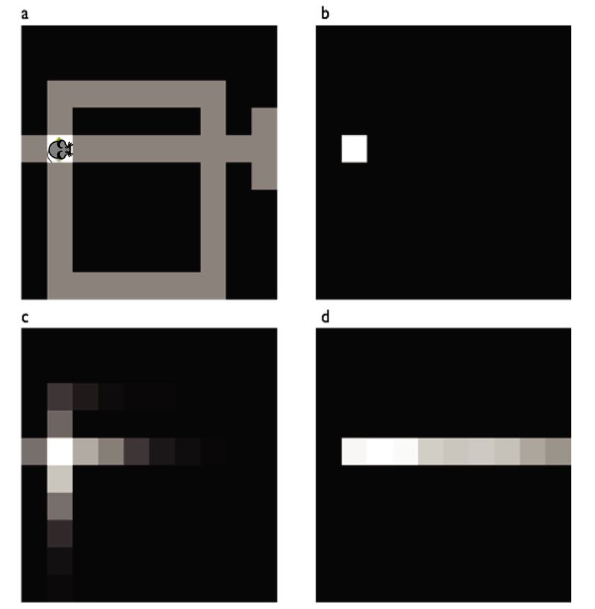

[rightcol]

* The SR represents whether a state can be reached from the current state (b).

* The SR depends on the policy:

    * A random agent will map the local neighborhood (c).

    * A goal-directed agent will have SR representations that follow the optimal path (d).

* It is therefore different from the transition matrix, as it depends on behavior and rewards.

* The exact dynamics are lost compared to MB: you only care whether a state is reachable, not how.

[endcol]

[citation Russek, E. M., Momennejad, I., Botvinick, M. M., Gershman, S. J., and Daw, N. D. (2017). Predictive representations can link model-based reinforcement learning to model-free mechanisms. PLOS Computational Biology 13, e1005768. doi:10.1371/journal.pcbi.1005768.]

# Example of a SR matrix

* The SR matrix reflects the proximity between states depending on the transitions and the policy.

* It does not have to be a spatial relationship.

[leftcol]

[rightcol]

[endcol]

[citation Stachenfeld, K. L., Botvinick, M. M., and Gershman, S. J. (2017). The hippocampus as a predictive map. Nature Neuroscience 20, 1643–1653. doi:10.1038/nn.4650]

# Learning the SR

* How can we learn the SR matrix for all pairs of states?

$$
    M^\pi(s, s') = \mathbb{E}_{\pi} [\sum_{k=0}^\infty \gamma^k \, \mathbb{I}(s_{t+k} = s') | s_t = s]
$$

* We first notice that the SR obeys a recursive Bellman-like equation:

$$\begin{aligned}
    M^\pi(s, s') &= \mathbb{I}(s_{t} = s') + \mathbb{E}_{\pi} [\sum_{k=1}^\infty \gamma^k \, \mathbb{I}(s_{t+k} = s') | s_t = s] \\
            &= \mathbb{I}(s_{t} = s') + \gamma \, \mathbb{E}_{\pi} [\sum_{k=0}^\infty \gamma^k \, \mathbb{I}(s_{t+k+1} = s') | s_t = s] \\
            &= \mathbb{I}(s_{t} = s') + \gamma \, \mathbb{E}_{s_{t+1} \sim \mathcal{P}^\pi(s' | s)} [\mathbb{E}_{\pi} [\sum_{k=0}^\infty \gamma^k \, \mathbb{I}(s_{t+k} = s') | s_{t+1} = s] ]\\
            &= \mathbb{I}(s_{t} = s') + \gamma \, \mathbb{E}_{s_{t+1} \sim \mathcal{P}^\pi(s' | s)} [M^\pi(s_{t+1}, s')]\\
\end{aligned}$$

# Model-based SR

* Bellman-like SR:

$$M^\pi(s, s') = \mathbb{I}(s_{t} = s') + \gamma \, \mathbb{E}_{s_{t+1} \sim \mathcal{P}^\pi(s' | s)} [M^\pi(s_{t+1}, s')]$$

* If we know the transition matrix for a fixed policy $\pi$: 

$$\mathcal{P}^\pi(s, s') = \sum_a \pi(s, a) \, p(s' | s, a)$$

we can obtain the SR directly with matrix inversion as we did in **dynamic programming**:

$$
    M^\pi = I + \gamma \, \mathcal{P}^\pi \times M^\pi
$$

so that:

$$
    M^\pi = (I - \gamma \, \mathcal{P}^\pi)^{-1}
$$

* This DP approach is called **model-based SR** (MB-SR) as it necessitates to know the environment dynamics.

 

[citation Momennejad, I., Russek, E. M., Cheong, J. H., Botvinick, M. M., Daw, N. D., and Gershman, S. J. (2017). The successor representation in human reinforcement learning. Nature Human Behaviour 1, 680–692. doi:10.1038/s41562-017-0180-8.]

# Model-free SR

* If we do not know the transition probabilities, we simply sample a single $s_t, s_{t+1}$ transition:

$$
    M^\pi(s_t, s') \approx \mathbb{I}(s_{t} = s') + \gamma \, M^\pi(s_{t+1}, s')
$$

* We can define a **sensory prediction error** (SPE):

$$
    \delta^\text{SR}_t = \mathbb{I}(s_{t} = s') + \gamma \, M^\pi(s_{t+1}, s') - M(s_t, s')
$$

that is used to update an estimate of the SR:

$$
    \Delta M^\pi(s_t, s') = \alpha \, \delta^\text{SR}_t
$$

* This is **SR-TD**, using a SPE instead of RPE, which learns only from transitions but ignores rewards.

 

[citation Momennejad, I., Russek, E. M., Cheong, J. H., Botvinick, M. M., Daw, N. D., and Gershman, S. J. (2017). The successor representation in human reinforcement learning. Nature Human Behaviour 1, 680–692. doi:10.1038/s41562-017-0180-8.]

# The sensory prediction error - SPE

* The SPE has to be applied on ALL successor states $s'$ after a transition $(s_t, s_{t+1})$:

$$
    M^\pi(s_t, \mathbf{s'}) = M^\pi(s_t, \mathbf{s'}) + \alpha \, (\mathbb{I}(s_{t}=\mathbf{s'}) + \gamma \, M^\pi(s_{t+1}, \mathbf{s'}) - M(s_t, \mathbf{s'}))
$$

* Contrary to the RPE, the SPE is a **vector** of prediction errors, used to update one row of the SR matrix.

* The SPE tells how **surprising** a transition $s_t \rightarrow s_{t+1}$ is for the SR.

{width=40%}

[citation Stachenfeld, K. L., Botvinick, M. M., and Gershman, S. J. (2017). The hippocampus as a predictive map. Nature Neuroscience 20, 1643–1653. doi:10.1038/nn.4650]

# Successor representations

* The SR matrix represents the **expected discounted future state occupancy**:

$$M^\pi(s, s') = \mathbb{E}_{\pi} [\sum_{k=0}^\infty \gamma^k \, \mathbb{I}(s_{t+k} = s') | s_t = s]$$

* It can be learned using a TD-like SPE from single transitions:

$$
    M^\pi(s_t, \mathbf{s'}) = M^\pi(s_t, \mathbf{s'}) + \alpha \, (\mathbb{I}(s_{t}=\mathbf{s'}) + \gamma \, M^\pi(s_{t+1}, \mathbf{s'}) - M(s_t, \mathbf{s'}))
$$

[leftcol 60]

* The immediate reward in each state can be learned **independently from the policy**:

$$
    \Delta \, r(s_t) = \alpha \, (r_{t+1} - r(s_t))
$$

* The value $V^\pi(s)$ of a state is obtained by summing of all successor states:

$$
    V^\pi(s) = \sum_{s' \in \mathcal{S}} M(s, s') \times r(s')
$$

* This critic can be used to train an **actor** $\pi_\theta$ using regular TD learning.

[rightcol 40]

[citation Stachenfeld, K. L., Botvinick, M. M., and Gershman, S. J. (2017). The hippocampus as a predictive map. Nature Neuroscience 20, 1643–1653. doi:10.1038/nn.4650]

[endcol]

# Successor representation of actions

* Note that it is straightforward to extend the idea of SR to state-action pairs:

$$M^\pi(s, a, s') = \mathbb{E}_{\pi} [\sum_{k=0}^\infty \gamma^k \, \mathbb{I}(s_{t+k} = s') | s_t = s, a_t = a]$$

allowing to estimate Q-values:

$$
    Q^\pi(s, a) = \sum_{s' \in \mathcal{S}} M(s, a, s') \times r(s')
$$

using SARSA or Q-learning-like SPEs:

$$
    \delta^\text{SR}_t = \mathbb{I}(s_{t} = s') + \gamma \, M^\pi(s_{t+1}, a_{t+1}, s') - M(s_t, a_{t}, s')
$$

depending on the choice of the next action $a_{t+1}$ (on- or off-policy).

[citation Russek, E. M., Momennejad, I., Botvinick, M. M., Gershman, S. J., and Daw, N. D. (2017). Predictive representations can link model-based reinforcement learning to model-free mechanisms. PLoS Computational Biology, 13, e1005768. doi:10.1371/journal.pcbi.1005768]

# Successor features

[leftcol 60]

* The SR matrix associates each state to all others ($N\times N$ matrix): 

    * curse of dimensionality.
    
    * only possible for discrete state spaces.

* A better idea is to describe each state $s$ by a feature vector $\phi(s) = [\phi_i(s)]_{i=1}^d$ with less dimensions than the number of states.

* This feature vector can be constructed or learned by an autoencoder (latent representation).

[rightcol 40]

[endcol]

{width=60%}

[citation Stachenfeld, K. L., Botvinick, M. M., and Gershman, S. J. (2017). The hippocampus as a predictive map. Nature Neuroscience 20, 1643–1653. doi:10.1038/nn.4650]

[citation Source: <http://www.jessicayung.com/the-successor-representation-1-generalising-between-states/>]

# Successor features

* The **successor feature representation** (SFR) represents the discounted probability of observing a feature $\phi_j$ after being in s.

{width=60%}

* Instead of predicting when the agent will see a cat after being in the current state $s$, the SFR predicts when it will see eyes, ears or whiskers independently:

$$
    M^\pi_j(s) = M^\pi(s, \phi_j) = \mathbb{E}_{\pi} [\sum_{k=0}^\infty \gamma^k \, \mathbb{I}(\phi_j(s_{t+k})) | s_t = s, a_t = a]
$$

* Linear SFR (Gehring, 2015) supposes that it can be linearly approximated from the features of the current state:

$$
    M^\pi_j(s) = M^\pi(s, \phi_j) = \sum_{i=1}^d m_{i, j} \, \phi_i(s)
$$

[citation Source: <http://www.jessicayung.com/the-successor-representation-1-generalising-between-states/>]

[citation Gehring CA. 2015. Approximate Linear Successor Representation. Presented at the The multi-disciplinary conference on Reinforcement Learning and Decision Making (RLDM).]

# Successor features

* The value of a state is now defined as the sum over successor features of their immediate reward discounted by the SFR:

$$
    V^\pi(s) = \sum_{j=1}^d M^\pi_j(s) \, r(\phi_j) = \sum_{j=1}^d r(\phi_j) \, \sum_{i=1}^d m_{i, j} \, \phi_i(s)
$$

* The SFR matrix $M^\pi = [m_{i, j}]_{i, j}$ associates each feature $\phi_i$ of the current state to all successor features $\phi_j$.

    * Knowing that I see a kitchen door in the current state, how likely will I see a food outcome in the near future?

* Each successor feature $\phi_j$ is associated to an expected immediate reward $r(\phi_j)$.

    * A good state is a state where food features (high $r(\phi_j)$) are likely to happen soon (high $m_{i, j}$).

* In matrix-vector form:

$$
    V^\pi(s) = \mathbf{r}^T \times M^\pi \times \phi(s)
$$

[citation Gehring CA. 2015. Approximate Linear Successor Representation. Presented at the The multi-disciplinary conference on Reinforcement Learning and Decision Making (RLDM).]

# Successor features

* Value of a state:

$$
    V^\pi(s) = \mathbf{r}^T \times M^\pi \times \phi(s)
$$

* The reward vector $\mathbf{r}$ only depends on the features and can be learned independently from the policy, but can be made context-dependent:

    * Food features can be made more important when the agent is hungry, less when thirsty.

* **Latent learning** becomes possible in the same environment:

    * Different goals (searching for food or water, going to place A or B) only require different reward vectors.

    * The dynamics of the environment are stored in the SFR.

{width=60%}

[citation Source: <https://awjuliani.medium.com/the-present-in-terms-of-the-future-successor-representations-in-reinforcement-learning-316b78c5fa3>]

[citation Gehring CA. 2015. Approximate Linear Successor Representation. Presented at the The multi-disciplinary conference on Reinforcement Learning and Decision Making (RLDM).]

<!--

# Successor features

* How can we learn the SFR matrix $M^\pi$?

$$
    V^\pi(s) = \mathbf{r}^T \times M^\pi \times \phi(s)
$$

* We only need to use the sensory prediction error for a transition between the feature vectors $\phi(s_t)$ and $\phi(s_{t+1})$:

$$\delta_t^\text{SFR} = \phi(s_t) + \gamma \, M^\pi \times \phi(s_{t+1}) - M^\pi \times \phi(s_t)$$

and use it to update the whole matrix:

$$\Delta M^\pi = \delta_t^\text{SFR} \times \phi(s_t)^T$$

* However, this linear approximation scheme only works for **fixed** feature representation $\phi(s)$. We need to go deeper...

 

[citation Gehring CA. 2015. Approximate Linear Successor Representation. Presented at the The multi-disciplinary conference on Reinforcement Learning and Decision Making (RLDM).]

-->

# Deep Successor Reinforcement Learning

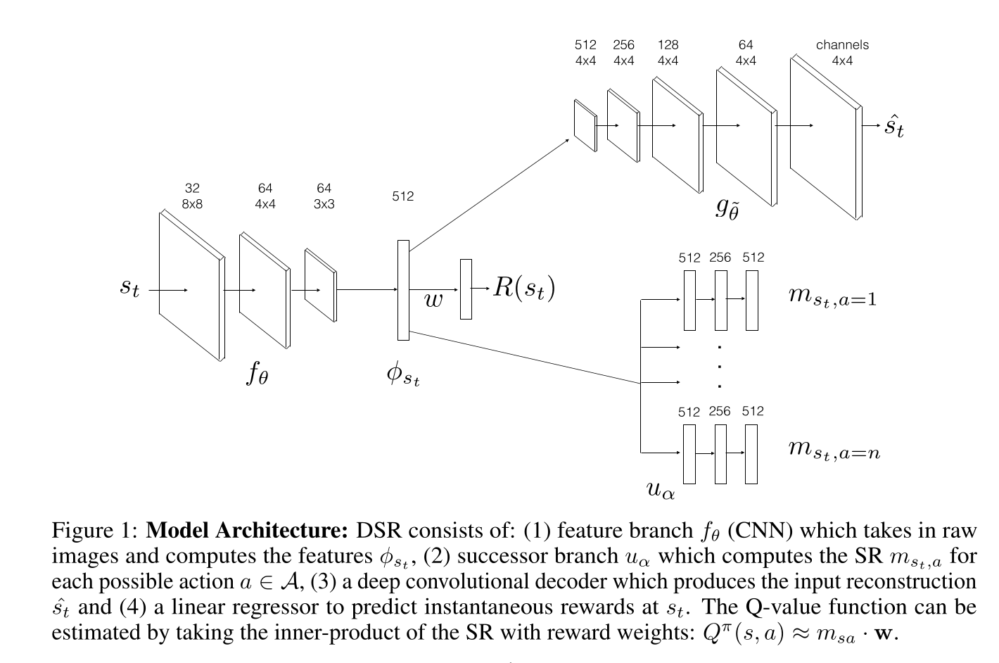

[citation Kulkarni, T. D., Saeedi, A., Gautam, S., and Gershman, S. J. (2016). Deep Successor Reinforcement Learning. arXiv:1606.02396]

# Visual Semantic Planning using Deep Successor Representations

<iframe width="800" height="500" src="https://www.youtube.com/embed/_2pYVw6ATKo" frameborder="0" allow="accelerometer; autoplay; clipboard-write; encrypted-media; gyroscope; picture-in-picture" allowfullscreen></iframe>

[citation Zhu Y, Gordon D, Kolve E, Fox D, Fei-Fei L, Gupta A, Mottaghi R, Farhadi A. (2017). Visual Semantic Planning using Deep Successor Representations. arXiv:170508080]

# 3 - Neurobiological support for the SR hypothesis

---

# The hippocampus as a predictive map

[leftcol]

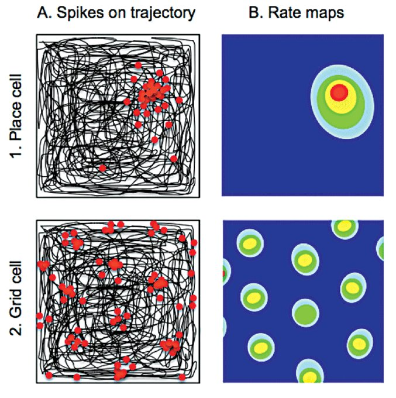

[rightcol]

* The main prediction of the SR hypothesis is that the hippocampus encode the SR.

* In navigation tasks, each place cell does not encode the position of the rat relative to a preferred position:

$$
    RF_i(x) = \exp^{- ||x - c_i ||^2}
$$

but rather the SR between the current position and the place field center:

$$
    RF_i(x) = \mathbb{E}_{\pi} [\sum_{k=0}^\infty \gamma^k \, \mathbb{I}(s_{t+k+1} = c_i) | s_t = x]
$$

[endcol]

* Place fields are now behavior-dependent and reward-dependent: they predict where the rat can go.

 

[citation Stachenfeld, K. L., Botvinick, M. M., and Gershman, S. J. (2017). The hippocampus as a predictive map. Nature Neuroscience 20, 1643–1653. doi:10.1038/nn.4650.]

# The hippocampus as a predictive map

[leftcol]

* The SR hypothesis explains how the place fields deform around walls or obstacles.

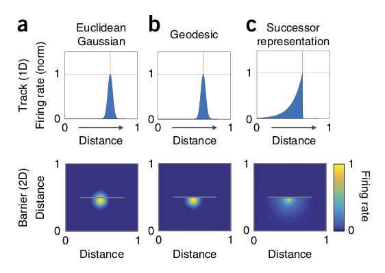

[rightcol]

[endcol]

[citation Stachenfeld, K. L., Botvinick, M. M., and Gershman, S. J. (2017). The hippocampus as a predictive map. Nature Neuroscience 20, 1643–1653. doi:10.1038/nn.4650.]

# The hippocampus as a predictive map

* The SR hypothesis predicts how place fields skew around obstacles and depend on the direction of movement.

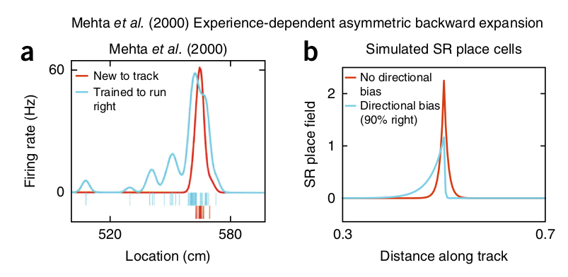

[citation Stachenfeld, K. L., Botvinick, M. M., and Gershman, S. J. (2017). The hippocampus as a predictive map. Nature Neuroscience 20, 1643–1653. doi:10.1038/nn.4650.]

# Grid cells as eigenvectors of the place cells

* Grid cells in the neotrhinal cortex are an eigendecomposition of the SR place cells, showing a spatially periodic structure.

* The SR predicts correctly that the grids align with the environment boundaries and adapt to different shapes.

[leftcol]

[rightcol]

[endcol]

[citation Stachenfeld, K. L., Botvinick, M. M., and Gershman, S. J. (2017). The hippocampus as a predictive map. Nature Neuroscience 20, 1643–1653. doi:10.1038/nn.4650.]

---

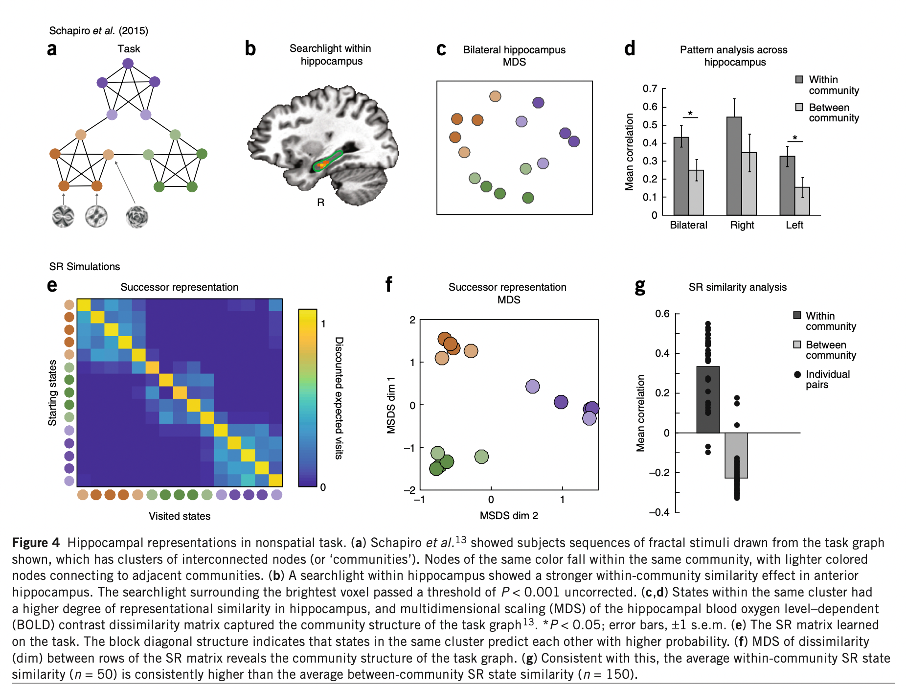

---

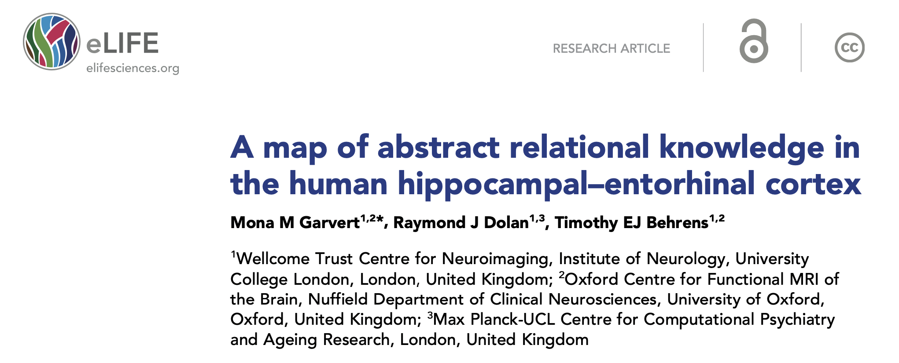

# A map of abstract relational knowledge in the human hippocampal–entorhinal cortex

[citation Garvert, M. M., Dolan, R. J., and Behrens, T. E. (2017). A map of abstract relational knowledge in the human hippocampal–entorhinal cortex. eLife 6, e17086. doi:10.7554/eLife.17086.]

# A map of abstract relational knowledge in the human hippocampal–entorhinal cortex

{width=60%}

[citation Garvert, M. M., Dolan, R. J., and Behrens, T. E. (2017). A map of abstract relational knowledge in the human hippocampal–entorhinal cortex. eLife 6, e17086. doi:10.7554/eLife.17086.]

# A map of abstract relational knowledge in the human hippocampal–entorhinal cortex

[leftcol]

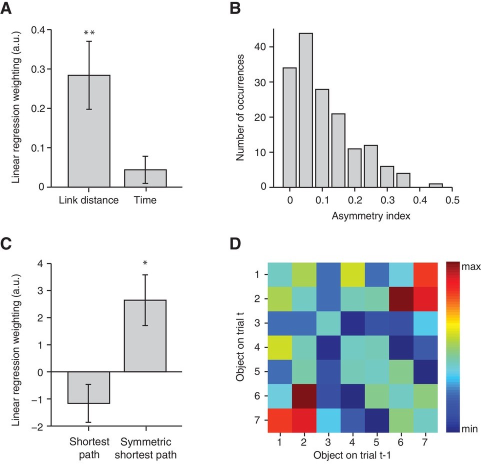

[rightcol]

* Entorhinal representations follow the map structure of the latent learning task.

* Representations are a weighted sum of future states, confirming the SR hypothesis.

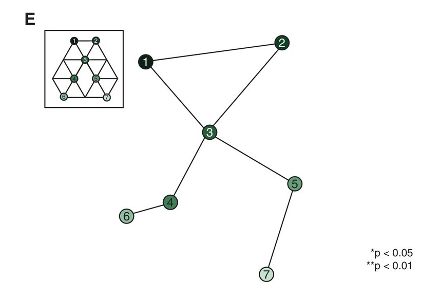

[endcol]

[citation Garvert, M. M., Dolan, R. J., and Behrens, T. E. (2017). A map of abstract relational knowledge in the human hippocampal–entorhinal cortex. eLife 6, e17086. doi:10.7554/eLife.17086.]

---

# The successor representation in human reinforcement learning

* Human RL can be studied in simple two-step tasks and re-learning either the reward expectations or the transition probabilities.

[leftcol 70]

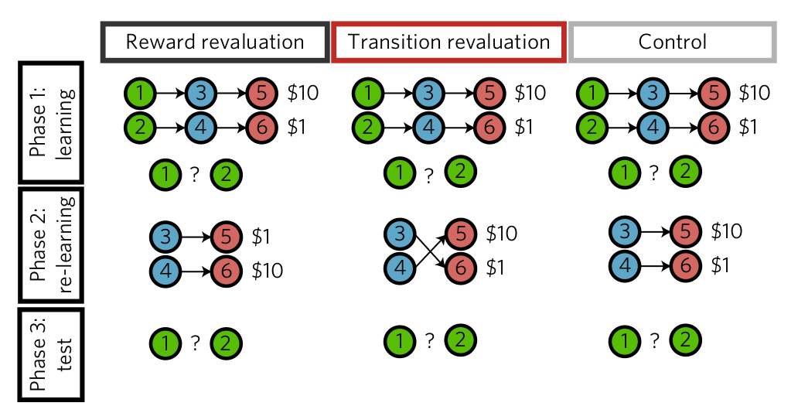

[rightcol 30]

[endcol]

[citation Momennejad, I., Russek, E. M., Cheong, J. H., Botvinick, M. M., Daw, N. D., and Gershman, S. J. (2017). The successor representation in human reinforcement learning. Nature Human Behaviour 1, 680–692. doi:10.1038/s41562-017-0180-8.]

# The successor representation in human reinforcement learning

* Human RL behavior is best explained by a linear combination of MB and SR processes.

[citation Momennejad, I., Russek, E. M., Cheong, J. H., Botvinick, M. M., Daw, N. D., and Gershman, S. J. (2017). The successor representation in human reinforcement learning. Nature Human Behaviour 1, 680–692. doi:10.1038/s41562-017-0180-8.]

# Probabilistic Successor Representations with Kalman Temporal Differences

[leftcol]

* You can get rid of the hybrid SR mechanism if you add **uncertainty estimation** of state representations using Kalman filters.

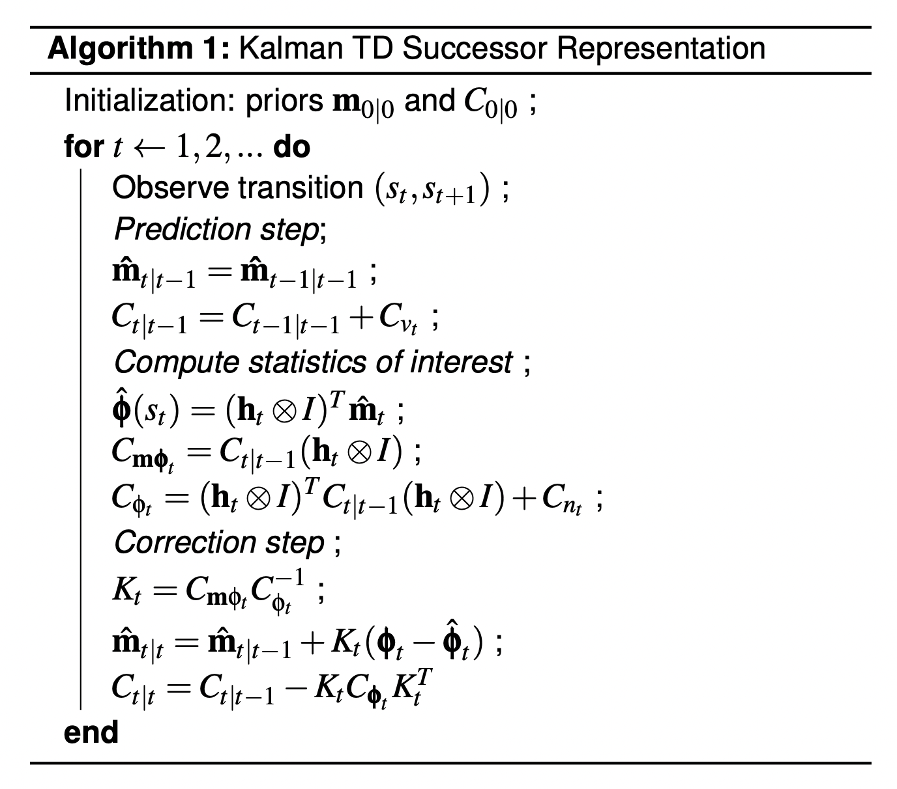

[rightcol]

[endcol]

[citation Geerts, J. P., Stachenfeld, K. L., and Burgess, N. (2019). Probabilistic Successor Representations with Kalman Temporal Differences. 2019 Conference on Cognitive Computational Neuroscience. doi:10.32470/CCN.2019.1323-0.]

---

# A general model of hippocampal and dorsal striatal learning and decision making

[citation Geerts, J. P., Chersi, F., Stachenfeld, K. L., and Burgess, N. (2020). A general model of hippocampal and dorsal striatal learning and decision making. PNAS 117, 31427–31437. doi:10.1073/pnas.2007981117.]

# A general model of hippocampal and dorsal striatal learning and decision making

[citation Geerts, J. P., Chersi, F., Stachenfeld, K. L., and Burgess, N. (2020). A general model of hippocampal and dorsal striatal learning and decision making. PNAS 117, 31427–31437. doi:10.1073/pnas.2007981117.]

# A general model of hippocampal and dorsal striatal learning and decision making

[citation Geerts, J. P., Chersi, F., Stachenfeld, K. L., and Burgess, N. (2020). A general model of hippocampal and dorsal striatal learning and decision making. PNAS 117, 31427–31437. doi:10.1073/pnas.2007981117.]

# A general model of hippocampal and dorsal striatal learning and decision making

{width=70%}

{width=70%}

[citation Geerts, J. P., Chersi, F., Stachenfeld, K. L., and Burgess, N. (2020). A general model of hippocampal and dorsal striatal learning and decision making. PNAS 117, 31427–31437. doi:10.1073/pnas.2007981117.]

---

# Multi-scale successor representations

[leftcol]

* A critical parameter of SR is $\gamma$, the discount rate determining how important are future states for the current state.

$$M^\pi(s, s') = \mathbb{E}_{\pi} [\sum_{k=0}^\infty \gamma^k \, \mathbb{I}(s_{t+k} = s') | s_t = s]$$

* Having SR representations at different horizons allows to represent temporal relationships at **different scales**.

* It can form the basis of **hierarchical RL**.

* There is indeed a ventro-dorsal gradient of the size of the place fields in the hippocampus.

[rightcol]

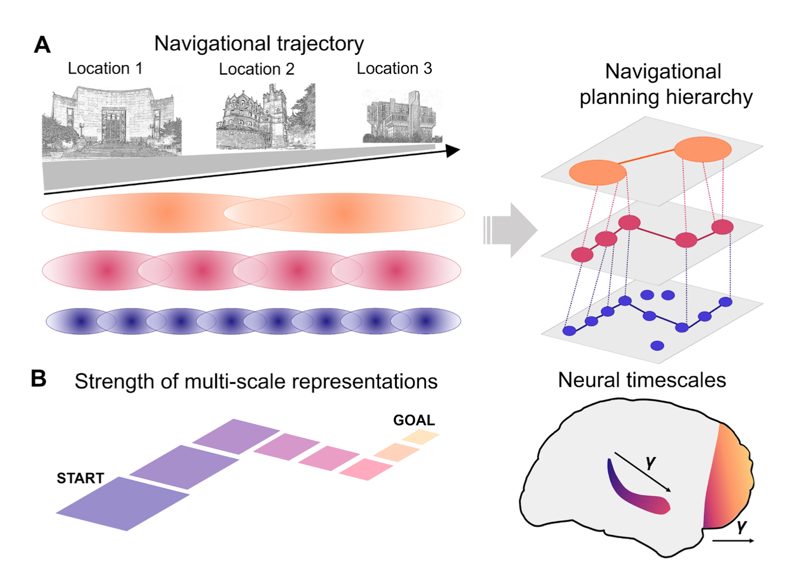

[endcol]

[citation Momennejad, I. (2020). Learning Structures: Predictive Representations, Replay, and Generalization. Current Opinion in Behavioral Sciences 32, 155–166. doi:10.1016/j.cobeha.2020.02.017.]

# Multi-scale successor representations

* It is furthermore possible to decode the **distance to a goal** based on multi-scale SR representations.

* A neurally plausible linear operation, namely the inverse of the Laplace transform, can be used to compute the derivative of multi-scale SR and obtain an estimation of the distance to a goal.

[leftcol]

[rightcol]

[endcol]

[citation Momennejad, I., and Howard, M. W. (2018). Predicting the future with multi-scale successor representations. bioRxiv, 449470. doi:10.1101/449470.]

# 4 - Discussion

# Successor representations and cognition

* The SR can explain hippocampal activity in both spatial (place cells) and non-spatial cognitive tasks.

* It realizes a trade-off between model-free and model-based learning, and can be combined with those two approaches to explain human reinforcement learning and spatial navigation strategies.

* There is not yet a realistic neuro-computational model that uses successor representations (ongoing work with Simon Schaal). 

# Can VTA encode the SPE?

[leftcol 70]

[rightcol 30]

* The SPE is a vector over all relevant task features.

* VTA only responds to reward magnitude / probability, it is not feature-specific.

* Some VTA neurons projecting to the tail of the striatum react for punishments (threat prediction error), but that is all.

[endcol]

[citation Watabe-Uchida, M., and Uchida, N. (2019). Multiple Dopamine Systems: Weal and Woe of Dopamine. Cold Spring Harb Symp Quant Biol, 037648. doi:10.1101/sqb.2018.83.037648.]

# Feature-specific prediction errors and surprise across macaque fronto-striatal circuits

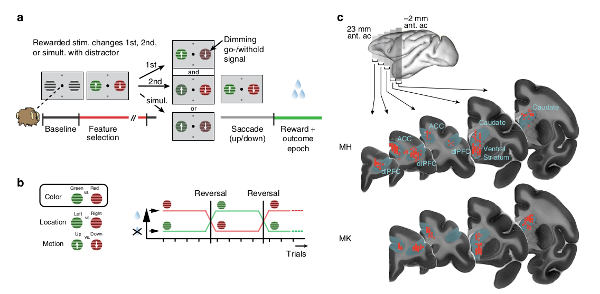

[citation Oemisch, M., Westendorff, S., Azimi, M., Hassani, S. A., Ardid, S., Tiesinga, P., et al. (2019). Feature-specific prediction errors and surprise across macaque fronto-striatal circuits. Nature Communications 10, 176. doi:10.1038/s41467-018-08184-9.]

# Sharp Wave Ripples to access and learn the SR ?

---

<video src="img/prospectiveencoding.webm" style="display:block; margin: 0 auto 10px 10px; width: 800px" controls allow="autoplay loop"></video>

[citation Johnson, A., and Redish, A. D. (2007). Neural Ensembles in CA3 Transiently Encode Paths Forward of the Animal at a Decision Point. J. Neurosci. 27, 12176–12189. doi:10.1523/JNEUROSCI.3761-07.2007.]
